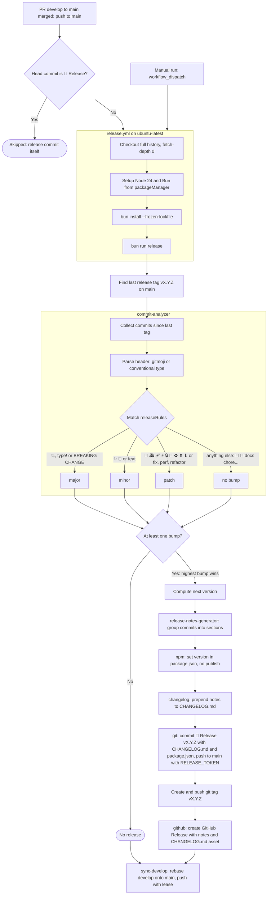

# Technical Guide

Detailed guide for technical implementation aspects.

## Tech Stack

| Category | Technology | Version |
|----------|------------|---------|
| Static site generator | Jekyll | 4.x |
| Runtime | Ruby | 3.3.5 |
| Package manager | Bun | >= 1.3.8 |
| Node | Node.js | >= 22.11.0 |
| CMS | jekyll-notion-cms gem | — |
| Hosting | GitHub Pages | — |
| Git hooks | Husky | ^9.1.7 |
| Staged files | lint-staged | ^16.2.7 |
| Commit tool | gitmoji-cli | ^9.7.0 |
| Commit lint | commitlint | ^20.4.1 |
| Markdown lint | markdownlint-cli | ^0.48.0 |

---

## Jekyll Configuration

### Config Files

| File | Purpose |
|------|---------|
| `_config.yml` | Base configuration (production) |
| `_config.dev.yml` | Development overrides (port 4001, livereload) |
| `_config_prod.yml` | Production-only optimizations |

### Plugins (Gemfile)

```ruby
gem "jekyll-feed"            # RSS/Atom feed
gem "jekyll-sitemap"         # XML sitemap
gem "jekyll-seo-tag"         # SEO meta tags
gem "jekyll-compress-images" # Image optimization
gem "jekyll-minifier"        # HTML/CSS/JS compression
gem "jekyll-notion-cms"      # Notion CMS integration
```

---

## Notion CMS Integration

The `jekyll-notion-cms` gem fetches data from Notion at build time and writes it to `_data/notion_*.yml` files.

### Plugin Behavior

- **With `NOTION_TOKEN`**: fetches live data from Notion databases
- **Without `NOTION_TOKEN`**: falls back to Jekyll collections in `_collections/`
- Generated files are in `.gitignore` and regenerated at each build

### Available Data

| Variable | Notion DB | Fallback |
|----------|-----------|---------|
| `site.data.notion_skills` | Skills DB | `_collections/_skills/` |
| `site.data.notion_experiences` | Experiences DB | `_collections/_experiences/` |
| `site.data.notion_awards` | Awards DB | `_collections/_awards/` |
| `site.data.notion_contributions` | Contributions DB | `_collections/_contributions/` |
| `site.data.notion_educations` | Educations DB | `_collections/_educations/` |
| `site.data.notion_services` | Services DB | `_collections/_services/` |
| `site.data.notion_testimonials` | Testimonials DB | `_collections/_testimonials/` |

See [`NOTION_SETUP.md`](./NOTION_SETUP.md) for full database schemas and Liquid usage examples.

---

## CI/CD

### Workflows

| Workflow | Trigger | Purpose |
|----------|---------|---------|
| `jekyll.yml` | Push to `main`, manual | Build with Notion content and deploy to GitHub Pages |
| `notion-sync.yml` | Manual (`workflow_dispatch`, called from Notion) | Rebuild and deploy after a Notion update |
| `lint.yml` | Push / PR to `develop` and `main` | Markdown, YAML and commit message linting |
| `release.yml` | Push to `main` (merged PR), manual | semantic-release (see [Semantic Release](#semantic-release)) |
| `setup.yml` | Manual | Apply `.github/settings.yml` with an `ADMIN_TOKEN` secret |

#### Build & Deploy

The site builds and deploys automatically on push to `main`, which only receives
release PRs from `develop`. The `🔖 Release` commit pushed by semantic-release
triggers one more deploy, with the same content.

Key steps:

1. Setup Ruby (asdf) + Bun
2. `bundle install` + `bun install`
3. Fetch Notion content (via `NOTION_TOKEN` secret)
4. `bundle exec jekyll build --config _config.yml,_config_prod.yml`
5. Deploy to GitHub Pages

#### Secrets Required

Configure in GitHub → Settings → Secrets → Actions:

- `NOTION_TOKEN` — required for Notion sync
- `NOTION_SKILLS_DB`, `NOTION_EXPERIENCES_DB`, etc. — database IDs
- `RELEASE_TOKEN` — admin PAT used by semantic-release to push to the protected `main`
  (see [Release Token](#release-token))
- `ADMIN_TOKEN` — only for the **Repository Setup** workflow

### Adding a Workflow

Workflows live in `.github/workflows/`. Follow the existing patterns:

- Use `actions/checkout@v4`
- Use `oven-sh/setup-bun@v2` for Bun
- Use `asdf-vm/actions/setup@v3` for Ruby

---

## Repository Setup

### Settings as Code

`.github/settings.yml` is the single source of truth for the GitHub
configuration (Settings app format):

| Section | Content |
|---------|---------|
| `repository` | Default branch `develop`, rebase-only merges, auto-merge, delete merged branches, vulnerability alerts on, Dependabot security updates off |
| `labels` | Type, priority, status and effort labels |
| `branches` | Protection of `develop` (PR + CI, no review, force push allowed for the post-release sync) and `main` (PR + CI, no approval since the repository has a single maintainer, no force push), resolved conversations, linear history |

It is applied by `scripts/setup-github.js`, idempotent:

```bash
bun run setup:github                              # apply everything
bun run setup:github --dry-run                    # preview
bun run setup:github --only=labels,protection     # some sections only
```

Sections: `branches` (create missing `main` / `develop`), `repository`,
`security`, `labels`, `protection`, `secrets` (stores `RELEASE_TOKEN` when it
is set in the environment, see [Release Token](#release-token)). Authentication comes from `GH_TOKEN` /
`GITHUB_TOKEN` or the local `gh` session; `repository`, `security` and
`protection` need admin rights. Without local access, run the **Repository
Setup** workflow (`setup.yml`) after adding an `ADMIN_TOKEN` secret (PAT with
repository Administration read & write).

Settings GitHub cannot apply are reported as warnings, not errors: on GitHub
Free, private repositories have no branch protection and no auto-merge.

---

## Git Hooks

### Pre-commit Hook

Husky runs lint-staged automatically:

```json
// package.json
{
  "lint-staged": {
    "*.md": "markdownlint --fix",
    "*.{yml,yaml}": "yamllint"
  }
}
```

### Commit-msg Hook

commitlint validates commit messages against gitmoji and conventional commit formats.

Configuration in `commitlint.config.js`.

### Post-checkout Hook: Local Branch Cleanup

On every branch switch (at most once per hour), `scripts/clean-branches.js`
deletes local branches whose PR was merged:

- the remote branch is gone (GitHub deletes it on merge)
- and all its commits are in `origin/develop` or `origin/main`, compared by
  content with `git cherry` (rebase merges rewrite SHAs, so
  `git branch --merged` cannot detect them)

Branches with commits missing from `develop` / `main` are kept and listed.
It is silent when offline or in detached HEAD (rebase in progress).

```bash
bun run clean:branches            # run now
bun run clean:branches --dry-run  # only list what would be deleted
```

### Setup

Hooks are configured automatically via the `prepare` script:

```bash
bun install  # Runs "husky" automatically
```

---

## Development Workflow

### Feature development

```bash
git checkout develop
git pull origin develop
git checkout -b feature/description

# ... make changes ...
make serve          # Preview at http://localhost:4001
bun run lint
bun run commit

# Before opening PR: rebase on latest develop
git fetch origin
git rebase origin/develop
git push origin feature/description
# → Open PR: feature/description → develop (rebase merge)
```

### Merge develop into main

```bash
# Once feature PRs are merged into develop:
git fetch origin
git checkout develop
git pull origin develop
# → Open PR: develop → main (rebase merge)
```

### Hotfix (urgent fix on main)

```bash
git checkout main
git pull origin main
git checkout -b hotfix/description

# ... fix ...
bun run commit
# → PR: hotfix/description → main (rebase merge)

# Re-sync develop
git checkout develop
git fetch origin
git rebase origin/main
git push origin develop --force-with-lease
```

### Syncing develop when main advances

```bash
# Automatic after every push to main (release.yml), manual fallback:
bun run sync:develop            # rebase develop onto main, push with lease
# never: git merge main         # ❌ creates a merge commit → blocks rebase PR
```

---

## Performance Targets

| Metric | Target |
|--------|--------|
| Lighthouse (all categories) | 95+ |
| First Contentful Paint | < 1.5s |
| Largest Contentful Paint | < 2.5s |
| Cumulative Layout Shift | < 0.1 |

### Image Optimization

- Format: WebP with fallbacks
- Responsive images with `srcset`
- Lazy loading enabled
- Automated via `jekyll-compress-images`

---

## SEO

Configuration in `_config.yml`:

```yaml
plugins:
  - jekyll-seo-tag

title: "Maxime Lenne - CTO & Tech Product Leader"
description: "Expert en entrepreneuriat tech, innovation et développement produit"
url: "https://maxime-lenne.fr"
author:
  name: "Maxime Lenne"
```

The `jekyll-seo-tag` plugin generates all meta tags, Open Graph, and JSON-LD automatically from front matter + `_config.yml`.

---

## Dependency Management

Dependencies (Bun packages, `packageManager`, GitHub Actions, Node version in
workflows) are updated by [Renovate](https://docs.renovatebot.com/). The
[Renovate GitHub App](https://github.com/apps/renovate) must be installed on
the repository.

`renovate.json` extends the shared preset
[`maxime-lenne/renovate-config`](https://github.com/maxime-lenne/renovate-config)
and only holds project-specific rules:

| Behavior | Value |
|----------|-------|
| Schedule | Monday before 10am (Europe/Paris) |
| Commit / PR title | `⬆️ Update dependency <name> to <version>` |
| Minimum release age | 3 days before a PR is opened |
| Grouping | Non-major dev dependencies, non-major GitHub Actions |
| Automerge | Minor, patch, pin, digest, lock file maintenance (rebase) |
| Manual review | Major updates, minor updates of `0.x` runtime dependencies |
| Security | Fix PRs opened immediately from GitHub vulnerability alerts |

Automerge needs no human action: Renovate enables GitHub auto-merge
(`allow_auto_merge` in `.github/settings.yml`), or merges the PR itself once
all CI checks are green when auto-merge is not available. `main` is never
targeted: Renovate PRs go to `develop` (default branch) and reach `main`
through the regular release PR.

Project-specific rules in `renovate.json`:

- `conventional-changelog-conventionalcommits` is held below v10 (see
  [Semantic Release](#semantic-release))

Dependabot security updates are disabled (`enable_automated_security_fixes:
false`) to avoid duplicate PRs; GitHub vulnerability alerts stay enabled.

---

## Semantic Release

Automated versioning, release notes and `CHANGELOG.md` based on commit
messages. Configuration lives in `release.config.js`:

```bash
# Run release (usually done by CI)
bun run release

# Dry run to preview release
bun run release:dry
```

### Version Bumping and Release Notes

The commit header is parsed so that the leading gitmoji (unicode or
`:shortcode:`) or, without emoji, the conventional type becomes the commit
type. The same table drives the version bump and the release notes section:

| Gitmoji | Conventional | Version Bump | Release notes section |
|---------|--------------|--------------|-----------------------|
| 💥 | `type!:` | Major | 💥 Breaking Changes |
| ✨ 🎉 | `feat` | Minor | ✨ Features |
| 🐛 🚑️ 🩹 | `fix` | Patch | 🐛 Bug Fixes |
| 🔒️ | | Patch | 🔒 Security |
| ⚡️ | `perf` | Patch | ⚡ Performance |
| ♻️ | `refactor` | Patch | ♻️ Refactoring |
| 🚀 | | Patch | 🚀 Deployment |
| ⬆️ ⬇️ | | Patch | ⬆️ Dependencies |
| Others (📝 🔧 ✅ ...) | `docs`, `chore`, `ci`... | None | Not listed |

A `BREAKING CHANGE:` footer always triggers a major release. Hybrid commits
(`✨ feat(api): add endpoint`) are classified by their gitmoji.

### Release Process

Releases are automated via GitHub Actions (`.github/workflows/release.yml`):



What each release produces:

| Output | Produced by | Content |
|--------|-------------|---------|
| Version number | `@semantic-release/commit-analyzer` | Highest bump among commits since last tag |
| Release notes | `@semantic-release/release-notes-generator` | Commits grouped by section, see table above |
| `package.json` version | `@semantic-release/npm` (`npmPublish: false`) | `vX.Y.Z` without the `v`, nothing published to npm |
| `CHANGELOG.md` | `@semantic-release/changelog` | Release notes inserted below the `# Changelog` title |
| Release commit | `@semantic-release/git` | `🔖 Release vX.Y.Z` with `CHANGELOG.md` + `package.json`, pushed to `main` |
| Git tag | semantic-release core | `vX.Y.Z` on the release commit |
| GitHub Release | `@semantic-release/github` | Release notes + `CHANGELOG.md` attached |

### Trigger

`release.yml` runs on every push to `main`, i.e. when the `develop → main` PR
is merged. It cannot run on the `pull_request` event: semantic-release never
publishes from a pull request context. The push of the `🔖 Release` commit
itself is skipped by the job condition. Git hooks are disabled in the job
(`HUSKY: 0`) so lint-staged and commitlint do not run on the release commit.

### Release Token

The release commit is pushed to `main`, which is protected (PR, checks,
review). `GITHUB_TOKEN` cannot bypass it, and on a personal account GitHub
Actions cannot be added as a bypass actor. Repository admins can
(`enforce_admins: false`), so the workflow uses a `RELEASE_TOKEN` secret: a
personal access token of a repository admin.

Create it once and reuse it for all repositories:

- Fine-grained PAT, resource owner = your account, **All repositories**,
  permissions: Contents, Issues, Pull requests (read and write)
- Or a classic PAT with the `repo` scope

Store it in each repository:

```bash
RELEASE_TOKEN=<pat> bun run setup:github --only=secrets
# or: gh secret set RELEASE_TOKEN
```

Without it, the workflow warns and falls back to `GITHUB_TOKEN`, which only
works when `main` is not protected (e.g. private repository on GitHub Free).

### After a Release: develop Sync

Rebase merges into `main` rewrite SHAs and the release adds a `🔖 Release`
commit, so `develop` no longer contains `main`'s tip and the next
`develop → main` PR would be out of date. The last step of `release.yml`
(also run when there is no release) calls `scripts/sync-develop.js`:

1. fetch `main` and `develop`; stop if `develop` already contains `main`
2. rebase `develop` onto `main`: commits already on `main` (same content) are
   dropped, the others are replayed on top of the `🔖 Release` commit
3. push `develop` with `--force-with-lease` (lease on the fetched SHA)

`develop` allows force pushes for that reason (GitHub applies the no-force-push
rule to admins too). On conflict the step fails: run `bun run sync:develop`
locally and resolve the rebase. See the README for the local commands
(`git reset --hard origin/develop`, `git rebase origin/develop`).

`conventional-changelog-conventionalcommits` must stay on `^9`: v10 requires
`conventional-changelog-writer@9`, not yet used by
`@semantic-release/release-notes-generator@14`.

---

## Available Scripts

```bash
# Install
make install          # Ruby (bundle) + Node (bun)

# Development
make serve            # Dev server with live reload
make quick-serve      # Server without initial build
make build            # Dev build
make clean            # Clean _site, .jekyll-cache, .sass-cache

# Production
make production       # Production build
make prod-build       # Production build + Notion sync

# Linting
bun run lint          # All linters
bun run lint:md       # Markdown only
bun run lint:md:fix   # Auto-fix markdown
bun run lint:yaml     # YAML files
bun run lint:commit   # Validate last commit

# Content
make sync-experiences # Update the experience pages from Notion

# Commits
bun run commit        # Interactive gitmoji commit

# Release and repository
bun run release:dry     # Preview the next release
bun run setup:github    # Apply .github/settings.yml (admin, gh session)
bun run clean:branches  # Delete local branches whose PR was merged
bun run sync:develop    # Re-sync develop with main after a release
```

---

## Linting Rules

### Markdownlint

Configuration in `.markdownlint.json`:

- Line length: 120 characters
- `MD024` (duplicate headings): disabled
- `MD033` (inline HTML): disabled
- `MD041` (first heading H1): disabled

### Yamllint

Configuration in `.yamllint.yml`:

- Ignores `_site/`, `vendor/`, `.git/`
- Standard indentation and line length rules

---

*Last updated: 2026-03-18*
